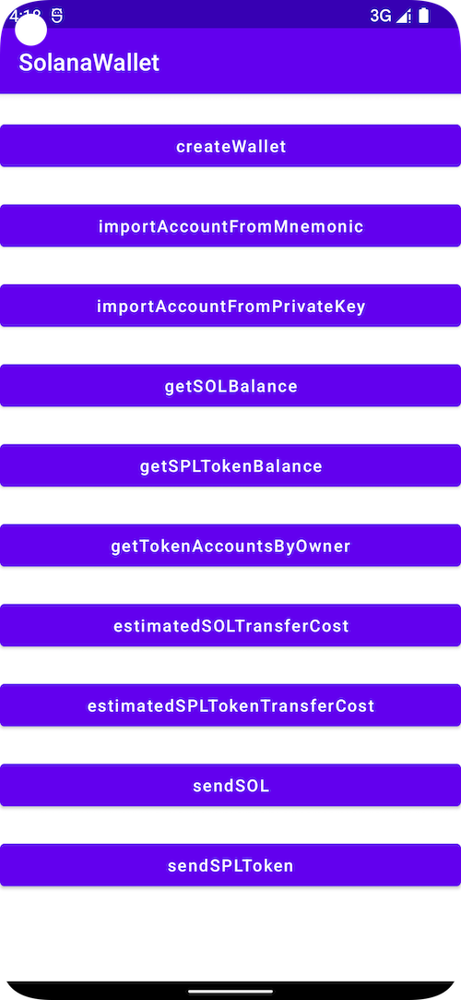

# SolanaWallet
**SolanaWallet** is an Android toolbelt for interaction with the Solana network.




For more specific usage, please refer to the [demo](https://github.com/Elizabet1926/SolanaWallet/tree/master/app)

## JitPack.io

I strongly recommend https://jitpack.io
```groovy
repositories {
    ...
    maven { url 'https://jitpack.io' }
}
dependencies {
    implementation 'com.github.Elizabet1926:SolanaWallet:1.0.3'
}
```

##### Setup SolanaWeb 
```kotlin
val onCompleted = {result : Boolean ->
    if (type == "SOL") SOLTransfer() else SPLTokenTransfer()
}
if (solanaweb?.isGenerateTronWebInstanceSuccess == false) {
    solanaweb?.setup(true,onCompleted)
} else  {
    if (type == "SOL") SOLTransfer() else SPLTokenTransfer()
}
```

##### Send SOL
```Kotlin
val privateKey = ""
val toAddress = ""
val amount = ""
if (toAddress.isNotEmpty() && amount.isNotEmpty() && privateKey.isNotEmpty()) {
    val onCompleted = {result : Boolean, txid: String ->
        this.runOnUiThread {
            println(txid)
        }
    }
    solanaweb?.solanaTransfer(privateKey,toAddress,amount, endpoint = SolanaMainNet,onCompleted)
}

```
##### Send SPLToken
```Kotlin
val privateKey = ""
val toAddress = ""
val amount = ""
val splTokenAddress = ""
if (toAddress.isNotEmpty() && amount.isNotEmpty() && privateKey.isNotEmpty() && splTokenAddress.isNotEmpty()) {
    val onCompleted = {result : Boolean, txid: String ->
        this.runOnUiThread {
            println(txid)
        }
    }
solanaweb?.solanaTokenTransfer(privateKey,
    toAddress,
    splTokenAddress,
    endpoint = SolanaMainNet,
    amount,
    decimalPoints = 6.0,
    onCompleted)
}
```
For more specific usage, please refer to the [demo](https://github.com/Elizabet1926/SolanaWallet/tree/master/app)


## License

TronWeb is released under the MIT license. [See LICENSE](https://github.com/Elizabet1926/SolanaWallet/blob/master/LICENSE) for details.
